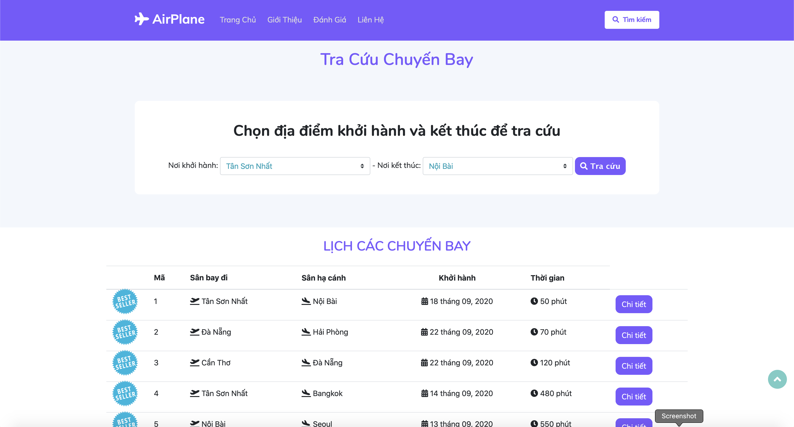
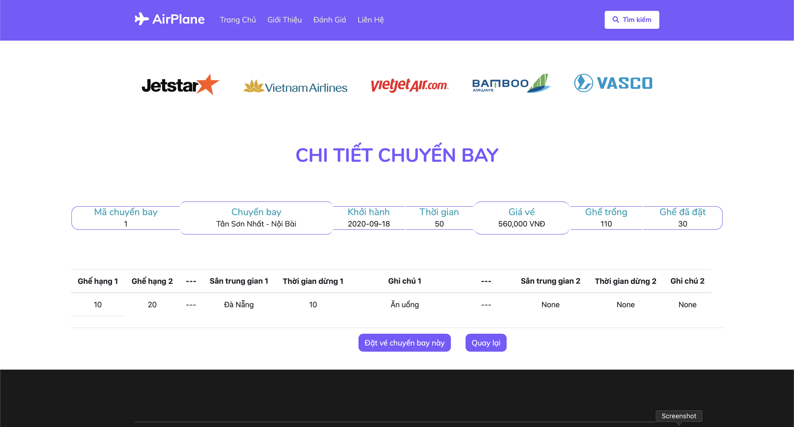
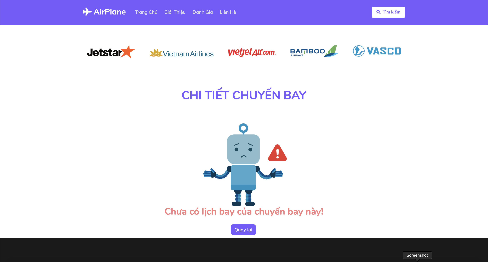
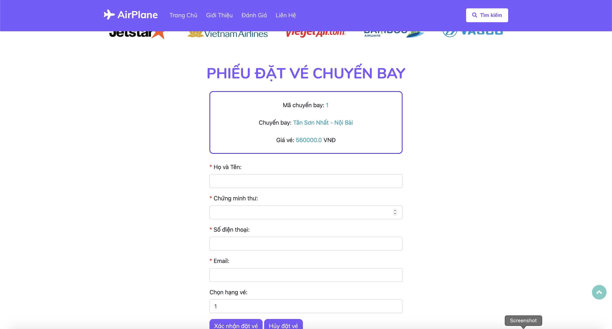
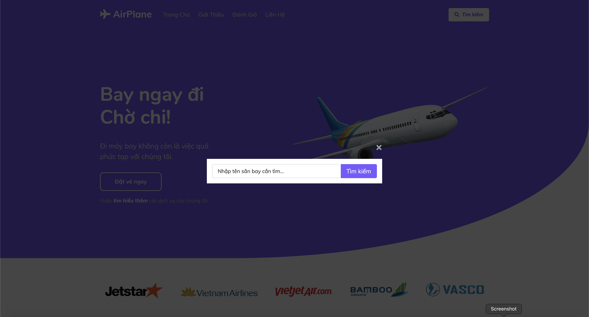
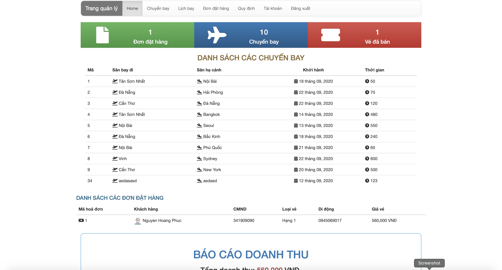

# Manager & Sell Airplane Tickets [Python with Flask]
## Guide
* Insert data from database.sql.
* Build this project environment with requirements.txt
* Manager account: admin/admin

### Home page

### List Flights

### Details Flight

### Flights have no schedule

### Order form

### Search

### Admin Page

Complex but not a problem!
